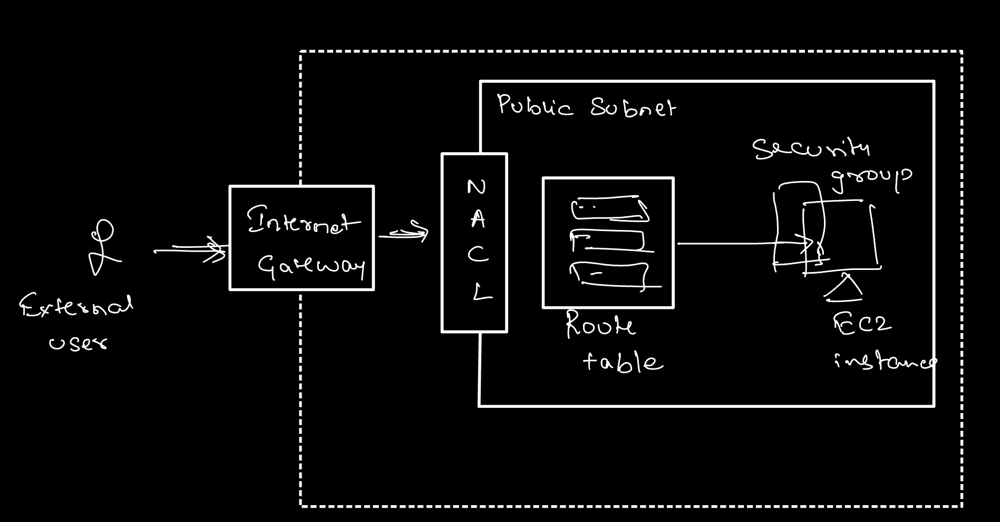
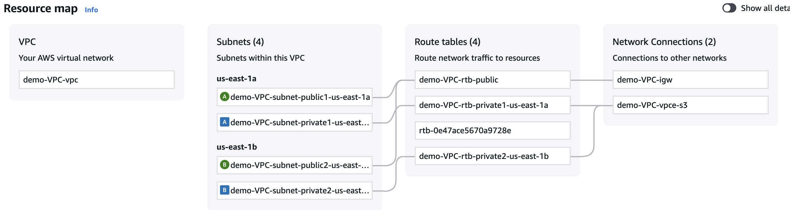
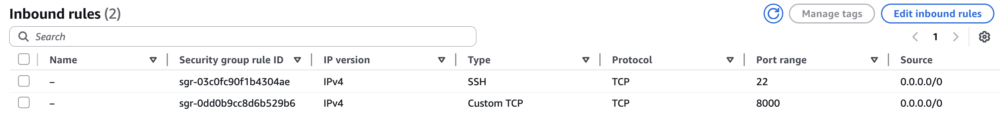
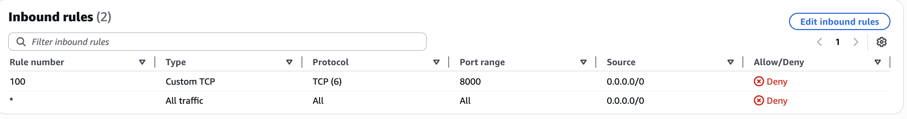

# AWS Security Group and NACL

VPC + load balancer + internet gateway

Subnet - range of IP address
Each VPC will have one or more subnet / range of IP's
Security at subnet level - using NACL
Security at EC2 level - using Security Groups (SGs)
 
SGs and NACLs act as the last point of security in the AWS a/c

All outbound traffic is by default allowed.
All inbound traffic is denied by default. 

Network Access Control List (NACL) - applied at subnet level. Can Deny or Allow traffic.
SG - can only allow traffic, can't deny

Here's a diagram with both the components involved: 

Step 1: Navigate to VPC and create one
Step 2: choose "VPC and more". AWS will now setup both public and private subnets in 2 AZs. AWS will also create route tables along with an internet gateway and some VPC endpoints for S3 buckets. 

Step 3: create EC2 in the public subnet of this new VPC 
Step 4: Edit network settings ->  choose the newly created VPC and a public subnet

Step 5: ssh into ec2 instance. Create a simple python application. Run a simple http server on port 8000
$ sudo apt update
$ sudo apt install python3
$ sudo apt install pip
$ python3 -m http.server 8000

ubuntu@ip-10-0-0-6:~$ python3 -m http.server 8000
Serving HTTP on 0.0.0.0 port 8000 (http://0.0.0.0:8000/) ...

http://&lt;public-ip-of-ec2&gt;:8000 - will not be available for public access

Step 6: Make sure NACL accept all incoming traffic. By default SGs deny all traffic. Add an inbound rule to accept traffic from anywhere on port 8000.

ec2 instance now accessible from any device on the internet.

As a policy, suppose you're not supposed to allow traffic at all on port 8000, you can enforce the same using a NACL.

- Navigate to Network ACLs
- Edit inbound rules
- Instead of allowing all traffic, remove the row and add new rule
- Rule should deny all requests that try to reach port 8000 

The ec2 is now unaccessible from the internet despite SG's allowing traffic because of NACL's.

Traffic on port 8000 will now be denied for all resources within the subnet.